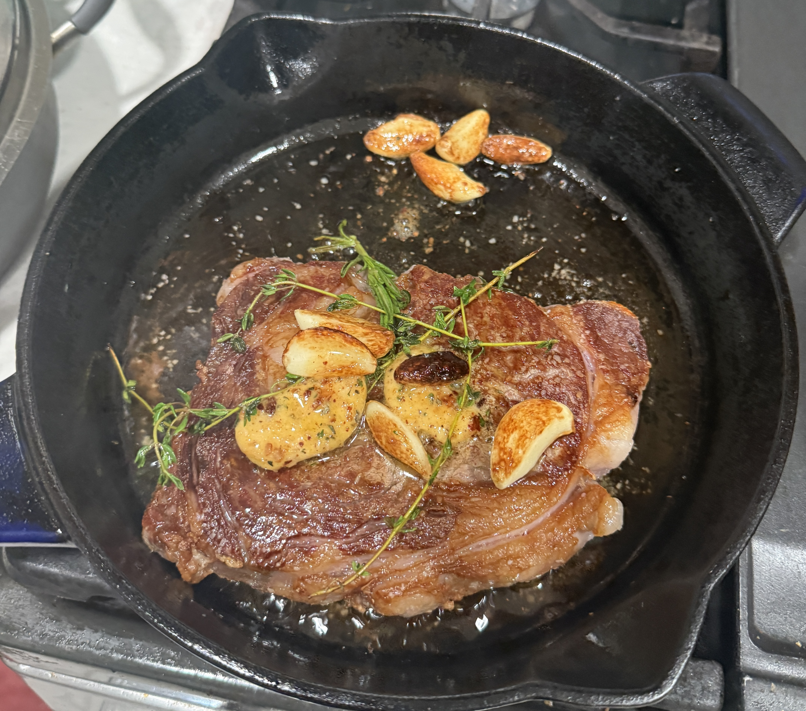

# Tim's User Page

## Table of Contents
- [About Me](#about-me)
- [My Programming Journey](#my-programming-journey)
- [My Projects](#my-projects)
- [Goals](#goals)
- [Fun Facts](#fun-facts)
- [Contact](#contact)

---

## About Me

Hi! I'm **Tim Nguyen**, a computer science student at UCSD.

I'm originally from **Orange County, California**. My hobbies include: 
1. going to the gym
2. [cooking](./assets/IMG_8342.JPG)
3. playing video games
4. [trying new restaurants](./assets/IMG_7563.JPG)
5. playing pickleball sometimes

<div style="display:flex; gap:10px; align-items:flex-start">
  <figure style="margin:0; width:25%">
    
    <figcaption style="text-align:center">Hako in Irvine</figcaption>
  </figure>
  
</div>

---

## My Programming Journey

I began coding in highschool, in AP Computer Science. I built simple projects like tic-tac-toe and a webpage.

Since then, I've experienced new courses, hackathons, and personal projects. I'm currently working on a nutrition tracker:

```python
def log_meal(food, calories):
    print(f"Logged: {food} — {calories} kcal")
```


---


## My Projects

Here are a few things I've built or am currently working on:

- [EcoForge](https://github.com/migingyn/EcoForge) — a steel supplier optimization tool that ranks steel suppliers based on cost, carbon emissions, and risk to support sustainable manufacturing decisions
- [LocusAI](https://github.com/migingyn/LocusAI) — a web app that scores and maps 37,000 census blocks across LA and Orange County to help users find neighborhoods that match their lifestyle

---

## Goals

### This Semester
- [x] Set up my GitHub profile
- [x] Learn the basics of Git branching
- [ ] Complete all programming assignments on time
- [ ] Build a full-stack web app from scratch

### Long-Term
- [ ] Land a software engineering internship
- [ ] Publish a mobile app

---

## Fun Facts

Here are some fun facts about me:

- 🎵 I listen to rap and r&b (my favorite artists are Ken Carson and PartyNextDoor)
- 📺 Currently watching *One Piece*. I'm on episode 650
- 🎮 I'm immortal on Valorant
- 🥩 I make **excellent** steak
> Better than restaurants I swear

---

## Contact

Feel free to reach out or connect with me:

- GitHub: [github.com/nyntim](https://github.com/nyntim)
- LinkedIn: [linkedin.com/in/tim-nguyen-11553127a](https://www.linkedin.com/in/tim-nguyen-11553127a/)
- Email: tin025@ucsd.edu

[Back to top](#tims-user-page)